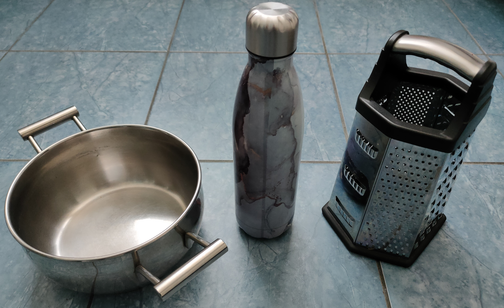
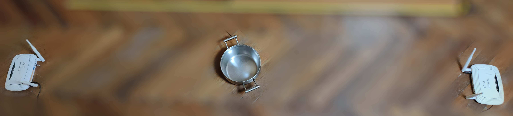
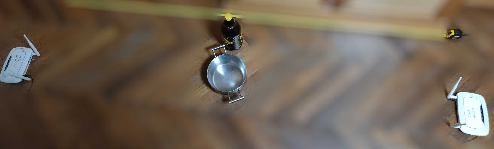
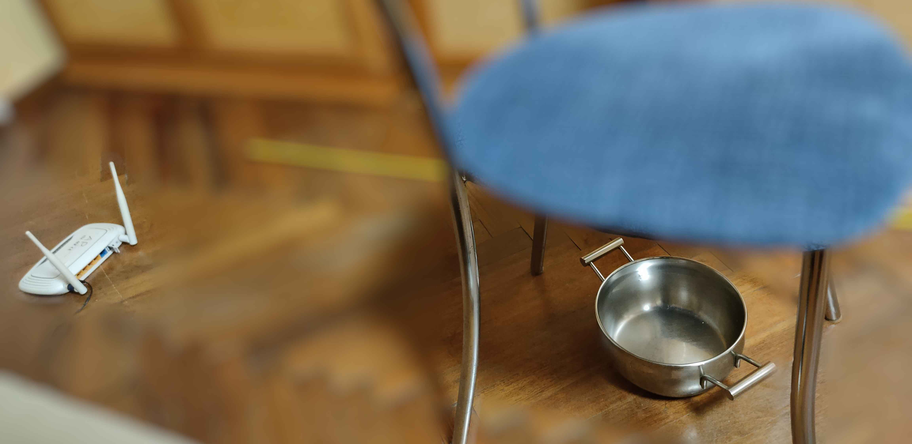
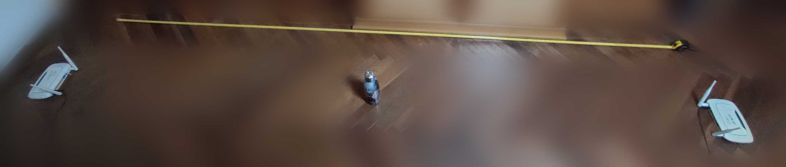
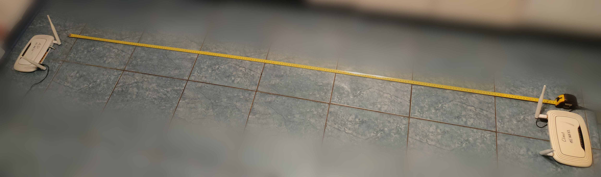

# Аннотация
Эксперимент по классификации металлических объектов с наличием искажений физической обстановки.

Полученные данные предназначены для изучения задачи детектирования (сначала детектирование, а потом распознавание конкретного металлического объекта), а также на фиксацию влияния изменения физической обстановки на результаты классификации и уменьшение этого влияния

## Фотографии эксперимента
Каждый эксперимент сопровождается фотографией размещения роутеров (папка img)

## Объекты
Расстояние между роутерами: 2 метра. Объект размещается примерно посередине между ними. Угол наклона антенн ~ 15 градусов суммарно (расстояние между концами антенн 20см). Установлен 11 канал Wi-Fi, 20 МГц (56 поднесущих на пару антенн Tx-Rx), расстояние между кончиками антенн 20 см. Суммарно для каждого из 6 экспериментов было снято по 30 000 пакетов. Они имеют следующий баланс данных:

1. Кастрюля (20%, 6000 пакетов)
2. Термос (20%, 6000 пакетов)
3. Терка (20% данных, 6000 пакетов)
4. Нет объекта (40%, 12000 пакетов)

## Эксперименты:
1) Базовый эксперимент (комната, 2 метра расстояние, нет посторонних предметов рядом) 
2) Сбоку от места размещения объекта фиксированно стоит полная бутылка воды 1.5 литра 
3) Над местом размещения объекта стоит стул с металлическими ножками 
4) Расстояние увеличено до 3 метров, оба маршрутизатора отодвигаются на 0.5 метров 
5) Другое помещение 
6) Базовый эксперимент - повтор в целях отладки (как test dataset для эксперимента №1)

## Сценарий исследования
Обучить модели на данных 1 эксперимента. Протестировать на 6 - если точность высока, то классификация возможна, и нужно тестировать модели на экспериментах 2-5. Если точность упала, то нужно обрабатывать данные CSI.

## Результаты
> Этот раздел будет дополнен