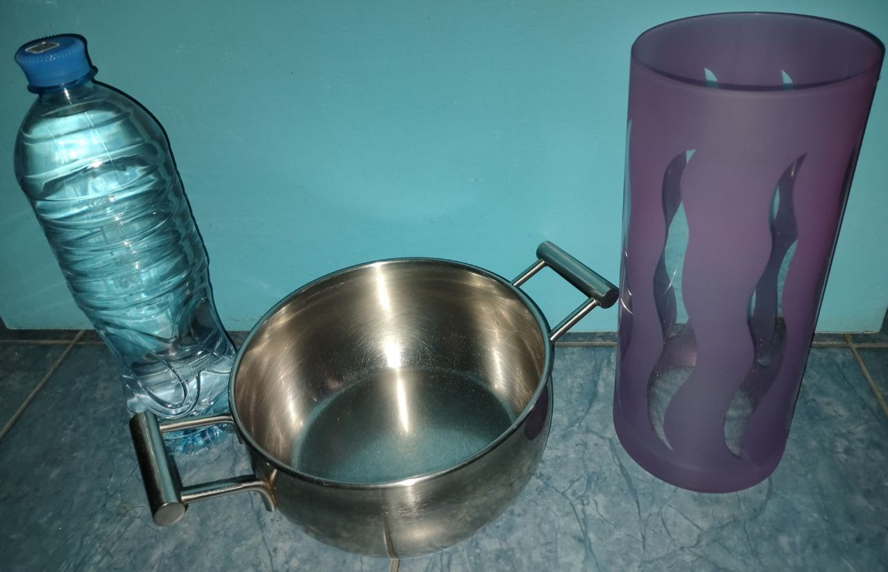

# Аннотация
Эксперимент по распознаванию факта нахождения трех объектов одновременно между маршрутизаторами. Дата: 25.02.2024.

Полученные данные предназначены для изучения задачи множественной классификации (multilabel).

# Объекты
